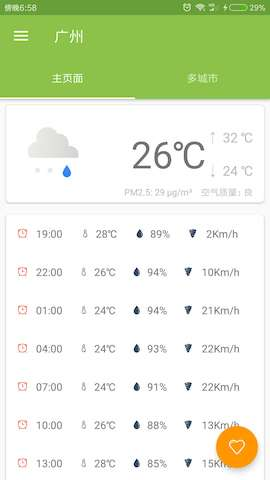
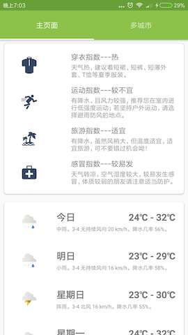
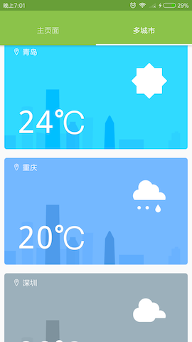
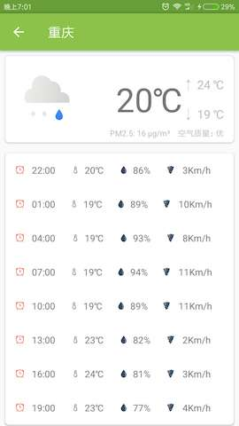

### 项目说明

SeeWeather的Kotlin版本实现,java版本的项目地址为:
[SeeWeather](https://github.com/xcc3641/SeeWeather)

### 下载地址
* [点击下载](https://github.com/HurTeng/Kotlin-SeeWeather/blob/master/app/release/app-release.apk?raw=true)

* 扫码安装

### 项目截图

* 首页

* 关注的城市

* 城市天气详情

